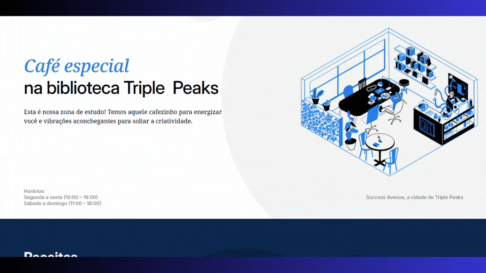

<h1 align= "center">

</h1>

<h1 align= "center">

</h1>

## **Projeto Café Triple Espresso**

Projeto desenvolvido durante bootcamp de desenvolvimento web Tripleten. O desafio era criar um site para um café utilizando as técnicas aprendidas na sprint 4.

## **🚀 Tecnologias**

- HTML
- CSS

## 🎯 Funcionalidade e Finalidade

O site foi criado para simular a presença online de um café. O objetivo é proporcionar uma experiência agradável ao usuário, seguindo boas práticas de desenvolvimento web com HTML, CSS e a metodologia BEM para organização do código.

🏷️ Recursos do site

- Espaço com vídeos de receitas

- Formulário para reserva de mesa

- Informações de contato do café

---

## 📚 O que Aprendi

Durante o desenvolvimento deste projeto, aprendi e pratiquei:

- Estruturação de páginas web com HTML avançado
- Estilização avançada com CSS
- Aplicação da metodologia BEM para organização do código e arquivos.
- Adição de fontes com Google Fonts
- Pseudoclasses e pseudoelementos
- Incorporação de conteúdos com elementos iframe
- Adicionar formulários
- Melhoria da responsividade da página

---

#### Feito com ❤️ por Alessandra Salviano
